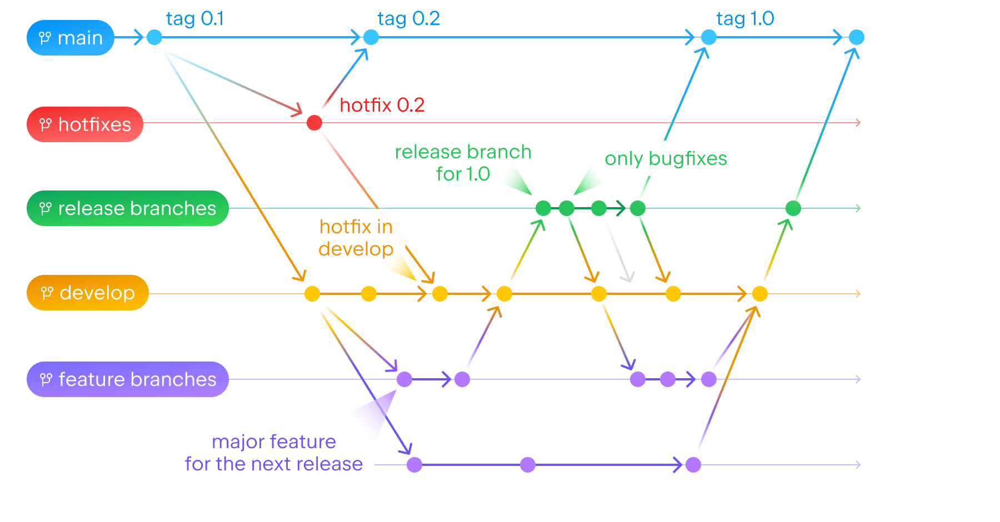

# Contributing

Процесс внесения изменений в проект SDDS iOS,

## Before commit
На каждом PR происходит прогон тестов и статических анализаторов. Влить PR не удастся без успешно пройденных тестов и валидных
результатов анализаторов. Поэтому перед коммитом запустите тот же процесс локально — это экономит время и не гоняет пайплайн зря.

```sh
./lint.sh                  # swiftlint по .swiftlint.yml
swiftlint --fix            # чинит косметику автоматом, запускать до ручных правок
ruby scripts/run_tests.rb  # swift test для DesignSystemBuilder + Xcode-схемы из скрипта
```

Обе команды запускаются из корня репозитория. Версия swiftlint должна совпадать с той, что
запинена в [.github/workflows/lint.yml](.github/workflows/lint.yml), иначе локальный и CI-прогон
дадут разные списки.

### Снапшот-тесты

Проверка эталонов — обычный прогон тестов. Чтобы **перезаписать** эталоны, переменная
режима передаётся тестовому процессу с префиксом `TEST_RUNNER_` — без него она до теста
не долетит:

```sh
TEST_RUNNER_SNAPSHOT_MODE=record xcodebuild -workspace SDDS.xcworkspace -scheme SDDSDemoApp \
  -destination 'platform=iOS Simulator,name=iPhone 16 Pro Max' test
```

Режим записи переписывает эталоны (`<test>_<Light|Dark>_375x812@3x.png`) и удаляет файлы
сравнения `_diff`/`_merge`/`_new`. Последние в git не попадают — они в `.gitignore`.

Эталоны зависят от версии Xcode и рантайма симулятора: `verify-snapshots.yml` намеренно
запинен на своей версии, отличной от остальных воркфлоу. Перезаписывать эталоны, снятые на
другой версии, нельзя — прогон в CI станет красным.

### Примеры в doc-комментариях

Секции «Пример использования» в `/** */` **не редактируются руками** — они генерируются из
фикстур. В комментарии стоит маркер, первой строкой swift-фенса:

```swift
/// ```swift
/// // @sample: SDDSComponentsFixtures/Samples/Card/SDDSCard_Simple.swift
/// ```
```

Чтобы поменять пример — правьте фикстуру в `SDDSComponentsFixtures/.../Samples/` и запускайте:

```sh
cd DesignSystemBuilder && ./build_cli.sh && ./build/dsbuilder/dsbuilder docs sync-comments --repo-root ..
```

Тот же сэмпл автоматически попадает в скриншот-тесты и в документационный бандл. В CI стоит
`--check`: если пример разошёлся с фикстурой, прогон падает.

`run_tests.rb` собирает покрытие (`-enableCodeCoverage YES` / `--enable-code-coverage`) и печатает
его в конце прогона; в CI то же самое попадает в summary джобы. Порогом покрытие не является.

> Бейджа покрытия в README нет намеренно. `xccov` считает покрытие `SDDSComponents` только по тем
> объектникам, которые втянул тестовый бинарь — библиотека линкуется статически, поэтому в отчёт
> попадает несколько файлов из сотен, и процент выглядит завышенным. Ставить такую цифру на
> витрину нельзя; чтобы бейдж стал честным, покрытие надо мерить по всей библиотеке.

Size-правила (`file_length`, `type_body_length`, `function_body_length`,
`cyclomatic_complexity`) настроены как warning без error-уровня: они подсвечивают рост в ревью,
но не роняют CI. Сгенерированный код (`Themes/`, `SDDSIcons/Generated/`, `*+Autogen.swift`)
из линта исключён — см. `excluded` в `.swiftlint.yml`.

> SwiftLint пропускает пути, в которых есть скрытая директория. Если работаете в git worktree
> внутри `.claude/`, `./lint.sh` молча не найдёт ни одного файла — передавайте пути явно
> (`swiftlint lint SDDSComponents/Sources`) или держите worktree вне скрытых папок.

## Issues

Если в процессе разработки выяснилось, что необходимо сделать какое-то изменение в будущем или встретился какой-либо баг,
то требуется создать новый [Issue](https://github.com/salute-developers/plasma-ios/issues), добавить в нём описание и требования,
а также отметить данный участок кода комментарием с ключевым словом `TODO` и ссылкой на issue:
```swift
// TODO: https://github.com/salute-developers/plasma-ios/issues/438
```

## Commit

Мы используем Conventional Commits (<https://www.conventionalcommits.org/>). Git commit message должен быть на английском языке.
Для удобства генерации release notes каждый коммит должен относиться к одному target и указывать его в скобках как скоуп.
Target -  это то, что мы собираем и выпускаем в релиз (:sdds-core:sandbox, :sdds-core:uikit, :sdds-core:plugin_theme_builder и т.д.).
Допустимые скоупы:
- sdds-icore/uikit
- sdds-icore/uikit-swift
- sdds-icore/theme-builder (DesignSystemBuilder / `dsbuilder`)
- sdds-icore/sandbox
- sdds-ios/build-system (не target, но нужно указывать, если есть изменения в build-system)
- sdds-ios/docs-aggregator (DesignSystemBuilder/DocsAggregatorCore и docs-template)
- sdds-ilibs/${libName} - где libName - это библиотеки для вертикалей

Примеры коммитов:

```sh
git commit -m "feat(sdds-icore/uikit-swift): Component Button was added"
git commit -m "fix(sdds-icore/sandbox): Buttons screen was fixed"
```

Использование Conventional Commits обязательно:

-   `fix` - если вносится исправление в существующую функциональность;
-   `feat` - если в кодовую базу добавляется новая функциональность;
-   `docs` - если вносится изменение в контент документации;
-   `chore` - если вносимые изменения не относятся ни к кодовой базе пакетов, ни к документации;
-   `build` - сборка пакетов и утилит;
-   `test` - для добавления / обновления тестов и снапшотов;
-   `ci` - для всех коммитов в папке .github

## Pull request

### Сборка для дизайн-ревью

Чтобы получить сборку демо-приложения в TestFlight, повесьте на PR лейбл **`testflight`**.
Ссылка на сборку придёт комментарием в PR через 20–30 минут. Каждый новый push в помеченный PR
пересобирает и присылает новый комментарий.

Тему можно выбрать вторым лейблом: `testflight:sddsserv`, `testflight:plasmab2c` или
`testflight:plasmahomeds`. Без него собирается общая схема со всеми темами.

Сборка стартует только после зелёных `test.yml` и `verify-snapshots.yml` на том же коммите.
Секреты подписи доступны только веткам этого репозитория — из форка сборка не поедет.


-   Создаем PR в ветку `develop`, дожидаемся успешного завершения работы CI.
-   Дописываем в главный коммент описание того, что было сделано и для чего.
-   Дожидаемся аппрува от всех ревьюеров ПРа.
-   Добавляем PR в очередь на merge.

## Релизный процесс
- Разработка ведется в `feature/` ветках, которые отводятся из ветки `develop`
- Каждые 2 недели `feature-freeze`, когда отводится ветка `release/`, а версия `develop` поднимается
- Ветка `release/` стабилизируется (вливаются только исправления дефектов) 2 недели
- По окончанию стабилизации `release/` ветки происходит `code-freeze` и публикация релиза
- Во время `code-freeze`, пока ветка `release/` вливается в `develop` и `main`, запрещено вливать любой код
- При необходимости из `main` ветки может создаваться ветка `hotfix`, которая потом тоже вливается в `main` и `develop`


