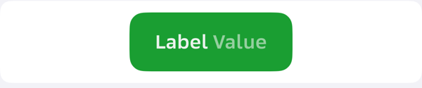
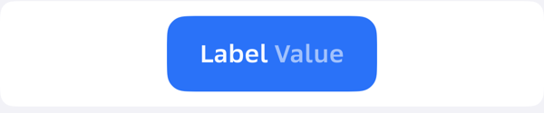
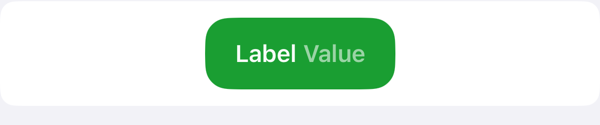
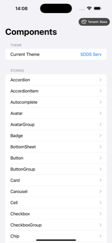
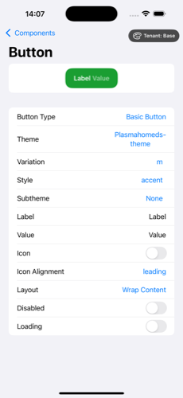
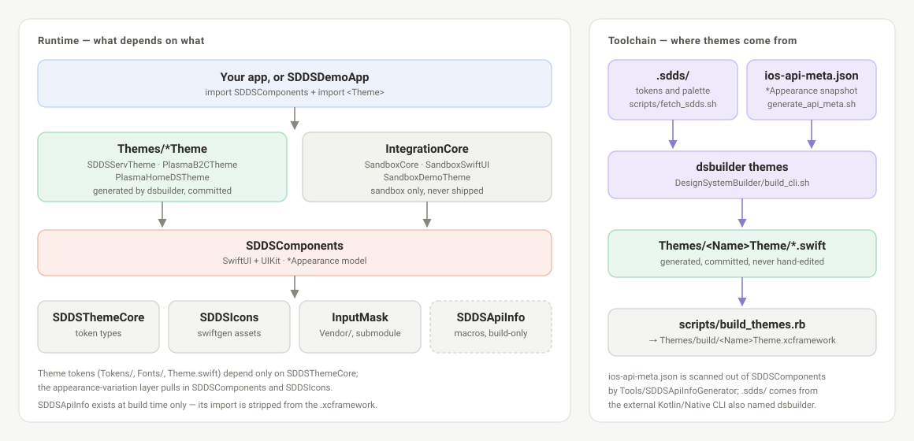

# SDDS iOS

[Русская версия](README.ru.md)

Salute Design System (SDDS) for iOS: SwiftUI & UIKit components, generated themes, and a
design-token codegen CLI.

[](https://github.com/salute-developers/plasma-ios/actions/workflows/test.yml)
[](https://github.com/salute-developers/plasma-ios/actions/workflows/lint.yml)
[](https://github.com/salute-developers/plasma-ios/actions/workflows/verify-snapshots.yml)
[](https://github.com/salute-developers/plasma-ios/releases)
[](LICENSE)
[](#requirements)
[](https://swift.org)
[](#installation)

CI badges track `develop` — the default branch, and the one you get from `git clone`. What is
released is shown by the release badge above.

The repository holds four things: a component library, the runtime token core the components are
styled from, the `dsbuilder` CLI that turns design tokens into theme packages, and a demo app
that renders every component in every theme.

## Contents

- [Requirements](#requirements)
- [Installation](#installation)
- [Quick start](#quick-start)
- [Themes](#themes)
- [Components](#components)
- [Architecture](#architecture)
- [Repository map](#repository-map)
- [Building from source](#building-from-source)
- [Contributing](#contributing)
- [License](#license)

## Requirements

| | |
|---|---|
| Platform | iOS 15+ |
| Language | Swift 5.9 |
| Tooling | Xcode 26.x, macOS for the `dsbuilder` CLI |
| Package manager | Swift Package Manager, or prebuilt `.xcframework` archives |

## Installation

### Swift Package Manager

Add the repository and pick the products you need.

Release tags are dated (`release-DD-MM-YYYY`), not semantic versions, and SwiftPM only accepts
semantic versions in `from:` / `exact:`. Pin a release by the commit it points at:

```swift
dependencies: [
    // git rev-list -n1 release-01-09-2026
    .package(
        url: "https://github.com/salute-developers/plasma-ios.git",
        revision: "5d4b336d16cb4bd637c24b7fcb310d7b0400d2c3"
    )
]
```

To always track the latest published state, use `branch: "main"` instead.

```swift
.target(
    name: "MyApp",
    dependencies: [
        .product(name: "SDDSComponents", package: "plasma-ios"),
        .product(name: "SDDSIcons", package: "plasma-ios"),
        .product(name: "SDDSServTheme", package: "plasma-ios")
    ]
)
```

Available products: `SDDSComponents`, `SDDSThemeCore`, `SDDSIcons`, `SDDSServTheme`,
`PlasmaB2CTheme`, `PlasmaHomeDSTheme`. `InputMask` is resolved from its own repository, so no
submodule checkout is needed.

### Prebuilt xcframeworks

Every release also publishes `.xcframework` archives — current versions and download URLs are
listed in [`release-manifest.json`](release-manifest.json). The minimum set for UI work:

| Module | Why |
|---|---|
| `SDDSThemeCore` | token types, always required |
| `SDDSComponents` | the components themselves |
| `SDDSIcons` | icon assets referenced by themes |
| `InputMask` | input masking, transitive from `SDDSComponents` |
| `<Name>Theme` | one theme, for example `SDDSServTheme` |

A third path is the **standalone theme bundle** — a flat folder of `.swift` files that compiles
as a single module without linking our libraries (`dsbuilder --standalone --components`, see
[docs/BUILD.md](docs/BUILD.md)).

## Quick start

Initialize a theme once at launch. `Theme.initialize()` registers the default appearance of every
component and registers the theme fonts. It is synchronous — fonts are embedded in the theme, so
nothing is fetched over the network.

```swift
import SwiftUI
import SDDSComponents
import SDDSServTheme

@main
struct MyApp: App {
    init() {
        SDDSServTheme.Theme.initialize()
    }

    var body: some Scene {
        WindowGroup {
            PayButton()
        }
    }
}

struct PayButton: View {
    var body: some View {
        BasicButton(
            title: "Pay",
            subtitle: "1 490 ₽",
            appearance: SDDSServTheme.BasicButton.l.accent.appearance,
            layoutMode: .wrapContent,
            action: {}
        )
    }
}
```

The variation chain reads as *size → style*: `BasicButton.l.accent`. Sizes are `.xxs` through
`.xl`; styles are `.default`, `.accent`, `.secondary`, `.positive`, `.negative`, `.warning`,
`.clear`, `.dark`, `.black`, `.white`. The exact set a theme ships is in
`Themes/<Name>Theme/BasicButton/BasicButton+Variations.swift`.

Drop the `appearance` argument and the component falls back to the default registered by
`Theme.initialize` — useful when a whole screen should follow the theme without per-call styling.

The module name of a theme is not always its folder name: `Themes/SDDSservTheme` vends the module
`SDDSServTheme`. `SDDSComponents` and the theme both declare types called `BasicButton`,
`IconButton` and so on, so theme variations are referenced module-qualified.

## Themes

Every component is styled by the active theme. The same `BasicButton` with the `accent` style,
rendered by the three themes shipped in this repository:

| SDDSServTheme | PlasmaB2CTheme | PlasmaHomeDSTheme |
|---|---|---|
|  |  |  |

The sandbox app browses every component and lets you flip theme, size, style and state at
runtime — the fastest way to see what a theme actually gives you. Each release attaches it as a
simulator build; see [running the demo](.github/templates/simulator-app-instructions.md).

<p>
  
  
</p>

## Components

64 components, grouped by role. Sources live in
[`SDDSComponents/Sources/SDDSComponents/Components/`](SDDSComponents/Sources/SDDSComponents/Components).

| Group | Components |
|---|---|
| **Buttons** | Button (basic, icon, link), ButtonGroup |
| **Inputs** | TextField, TextArea, CodeField, CodeInput, Autocomplete, Select, SelectItem, Editable, Wheel, FormItem |
| **Selection** | Checkbox, CheckboxGroup, Radiobox, RadioboxGroup, Switch, Segment, SegmentItem, Chip, ChipGroup |
| **Navigation** | NavigationBar, NavigationBarMainPage, NavigationBarInternalPage, CollapsingNavigationBar, Tabs, TabBar, Toolbar, DropdownMenu, PaginationDots |
| **Feedback & overlays** | Toast, Notification, NotificationContent, Note, NoteCompact, Tooltip, Popover, Modal, BottomSheet, Drawer, Overlay |
| **Layout** | Card, Cell, List, ListItem, Divider, Carousel, Accordion, AccordionItem, Scrollbar |
| **Data display** | Avatar, AvatarGroup, Badge, Counter, Indicator, ProgressBar, CircularProgressBar, Spinner, Loader, RectSkeleton, TextSkeleton, Image, Icon, Text |

Compilable usage samples for each are in
[`SDDSComponentsFixtures`](SDDSComponentsFixtures/README.md); they are marked `// @DocSample`, so
the same code feeds the documentation bundle and the screenshot tests.

## Architecture



The pipeline is **design tokens → `dsbuilder` → theme package → components → your app**.

`SDDSThemeCore` is the foundation: a portable package of token types with no internal
dependencies. `SDDSComponents` describes each component's look through an `*Appearance` struct.
A theme is generated on top of both, and it is deliberately two-layered — the token half
(`Tokens/`, `Fonts/`, `Theme.swift`) depends only on `SDDSThemeCore` and can be shipped alone,
while the appearance-variation half pulls in the full component library.

**Theme code generation is metadata-driven.** Rather than hand-writing a `Props`/`Appearance`
pair per component, `Tools/SDDSApiInfoGenerator` walks `SDDSComponents` with SwiftSyntax and
snapshots the public style API of every `*Appearance` into `ios-api-meta.json`. `dsbuilder` reads
that snapshot together with the design tokens and renders the theme through Stencil templates, so
a new component appears in every theme as soon as the metadata is regenerated. Property-level
markup lives in the library itself as real Swift attributes (`@ApiName`, `@ApiValue`, …) from the
[`SDDSApiInfo`](SDDSApiInfo/README.md) macro package, so a typo in the markup is a compile error
rather than a silently missing value.

Generated theme sources are committed, which keeps consumers free of the toolchain — but it also
means `Themes/*` must never be edited by hand.

## Repository map

| Path | What it is |
|---|---|
| [`SDDSComponents/`](SDDSComponents/README.md) | component library, SwiftUI + UIKit |
| [`DesignSystemBuilder/`](DesignSystemBuilder/README.md) | `dsbuilder` CLI: theme generation and documentation bundle |
| [`DesignSystemBuilder/SDDSThemeCore/`](DesignSystemBuilder/SDDSThemeCore/README.md) | runtime token types |
| [`Themes/`](Themes/README.md) | generated theme packages |
| [`SDDSIcons/`](SDDSIcons/README.md) | icon asset bundle (swiftgen) |
| [`SDDSDemoApp/`](SDDSDemoApp/README.md) | demo app and component sandbox |
| [`IntegrationCore/`](IntegrationCore/README.md) | sandbox core: stories, theme manager, SwiftUI layer |
| [`SDDSComponentsFixtures/`](SDDSComponentsFixtures/README.md) | compilable documentation samples |
| [`SDDSApiInfo/`](SDDSApiInfo/README.md) | style-API markup macros |
| [`Tools/SDDSApiInfoGenerator/`](Tools/SDDSApiInfoGenerator/README.md) | `*Appearance` scanner producing `ios-api-meta.json` |
| [`scripts/`](scripts/README.md) | build, release and generation scripts |
| [`Vendor/`](Vendor/README.md) | third-party dependencies (git submodules) |

## Building from source

Full instructions — building xcframeworks, individual modules, the demo sandbox per theme, and
the `dsbuilder` CLI — are in [docs/BUILD.md](docs/BUILD.md). The short version:

```sh
git submodule update --init --recursive
ruby ./scripts/build_xcframeworks.rb -d . -w SDDS.xcworkspace
```

Then open `SDDS.xcworkspace`, pick a scheme and run.

## Contributing

Read [CONTRIBUTING.md](CONTRIBUTING.md) first: Conventional Commits with an iOS scope, GitFlow
branching, and the two commands to run before every commit:

```sh
./lint.sh
ruby scripts/run_tests.rb
```

- [Code of Conduct](CODE_OF_CONDUCT.md)
- [Security policy](SECURITY.md) — report vulnerabilities privately, never as a public issue
- [Changelog](CHANGELOG.md) and [Releases](https://github.com/salute-developers/plasma-ios/releases)
- [AI-assisted workflow](docs/AI_WORKFLOW.md) — what the `CLAUDE.md` and `openspec/` files are for

The same design system on other platforms:
[plasma-android](https://github.com/salute-developers/plasma-android) ·
[plasma (web)](https://github.com/salute-developers/plasma).

## Contributors

| | GitHub |
|---|---|
| Vladimir Kaltyrin | [@vkaltyrin](https://github.com/vkaltyrin) |
| Димитраки Владимир | [@VladimirDimitraki](https://github.com/VladimirDimitraki) |
| Ангир Булинов | [@angirb](https://github.com/angirb) |
| Alex Bodrov | [@amidaleet](https://github.com/amidaleet) |

Ordered by number of commits. Live counts are in the
[contributor graph](https://github.com/salute-developers/plasma-ios/graphs/contributors), which
also lists the release automation account; who reviews what is in [CODEOWNERS](CODEOWNERS).

## License

MIT — see [LICENSE](LICENSE). Third-party components and their licenses are listed in
[THIRD_PARTY_LICENSES.md](THIRD_PARTY_LICENSES.md).
