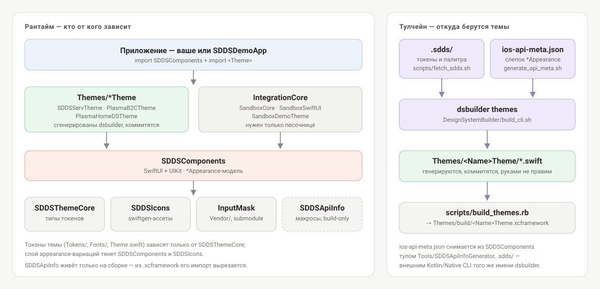

# SDDS iOS

[English version](README.md)

Адаптация дизайн-системы **SDDS** (Salute Design System) под iOS: библиотека компонентов на
SwiftUI + UIKit, рантайм-ядро токенов, CLI генерации тем из дизайн-токенов и демо-песочница.

| | |
|---|---|
| Платформа | iOS 15+ |
| Язык | Swift 5.9 |
| Тулчейн | Xcode 26.x, macOS для CLI `dsbuilder` |
| Подключение | Swift Package Manager либо готовые `.xcframework` |

## Подключение

### Swift Package Manager

Подключите репозиторий и выберите нужные продукты.

Теги релизов — датированные (`release-DD-MM-YYYY`), а не семверные, и SwiftPM принимает в
`from:` / `exact:` только семвер. Поэтому релиз пиньте коммитом, на который он указывает:

```swift
dependencies: [
    // git rev-list -n1 release-01-09-2026
    .package(
        url: "https://github.com/salute-developers/plasma-ios.git",
        revision: "5d4b336d16cb4bd637c24b7fcb310d7b0400d2c3"
    )
]
```

Чтобы всегда быть на последнем опубликованном состоянии — `branch: "main"`.

```swift
.target(
    name: "MyApp",
    dependencies: [
        .product(name: "SDDSComponents", package: "plasma-ios"),
        .product(name: "SDDSIcons", package: "plasma-ios"),
        .product(name: "SDDSServTheme", package: "plasma-ios")
    ]
)
```

Доступные продукты: `SDDSComponents`, `SDDSThemeCore`, `SDDSIcons`, `SDDSServTheme`,
`PlasmaB2CTheme`, `PlasmaHomeDSTheme`. `InputMask` резолвится из своего репозитория —
инициализировать submodule потребителю не нужно.

### Готовые xcframework

Каждый релиз публикует `.xcframework`; актуальные версии и ссылки — в
[`release-manifest.json`](release-manifest.json). Минимальный набор:

| Модуль | Зачем |
|---|---|
| `SDDSThemeCore` | типы токенов, обязателен |
| `SDDSComponents` | сами компоненты |
| `SDDSIcons` | иконки, на которые ссылаются темы |
| `InputMask` | маскирование ввода (транзитивно от `SDDSComponents`) |
| `<Name>Theme` | конкретная тема, например `SDDSServTheme` |

Третий путь — **автономный бандл темы** — плоская папка `.swift`, компилируемая одним модулем без линковки наших библиотек
(`dsbuilder --standalone --components`, см. [docs/BUILD.md](docs/BUILD.md)).

## Быстрый старт

`Theme.initialize()` регистрирует дефолтный appearance всех компонентов и шрифты темы —
вызывается один раз на старте приложения. Он синхронный: шрифты вшиты в тему, в сеть
никто не ходит.

```swift
import SwiftUI
import SDDSComponents
import SDDSServTheme

@main
struct MyApp: App {
    init() {
        SDDSServTheme.Theme.initialize()
    }

    var body: some Scene {
        WindowGroup {
            PayButton()
        }
    }
}

struct PayButton: View {
    var body: some View {
        BasicButton(
            title: "Оплатить",
            subtitle: "1 490 ₽",
            appearance: SDDSServTheme.BasicButton.l.accent.appearance,
            layoutMode: .wrapContent,
            action: {}
        )
    }
}
```

Цепочка вариации читается как «размер → стиль»: `BasicButton.l.accent`. Размеры — от `.xxs`
до `.xl`; стили — `.default`, `.accent`, `.secondary`, `.positive`, `.negative`, `.warning`,
`.clear`, `.dark`, `.black`, `.white`. Точный набор конкретной темы — в
`Themes/<Name>Theme/BasicButton/BasicButton+Variations.swift`.

Если `appearance` не передать, компонент возьмёт дефолт, зарегистрированный `Theme.initialize`.

> Имя модуля темы не всегда совпадает с именем каталога: `Themes/SDDSservTheme` отдаёт модуль
> `SDDSServTheme`. `SDDSComponents` и тема объявляют одноимённые типы (`BasicButton`,
> `IconButton`, …), поэтому вариации темы адресуем с именем модуля.

## Темы

Внешний вид компонента задаёт активная тема. Один и тот же `BasicButton` со стилем `accent`
в трёх темах репозитория:

| SDDSServTheme | PlasmaB2CTheme | PlasmaHomeDSTheme |
|---|---|---|
|  |  |  |

Песочница показывает все компоненты и позволяет на лету менять тему, размер, стиль и состояние —
быстрее всего понять, что даёт конкретная тема. К каждому релизу прикладывается сборка под
симулятор, инструкция — [здесь](.github/templates/simulator-app-instructions.md).

<p>
  
  
</p>

## Архитектура



Конвейер: **дизайн-токены → `dsbuilder` → пакет темы → компоненты → приложение**.

`SDDSThemeCore` — фундамент: портируемый пакет типов токенов без внутренних зависимостей.
`SDDSComponents` описывает внешний вид каждого компонента структурой `*Appearance`. Тема
генерируется поверх обоих и намеренно двухуровневая: слой токенов (`Tokens/`, `Fonts/`,
`Theme.swift`) зависит только от `SDDSThemeCore` и бандлится отдельно, слой appearance-вариаций
тянет всю библиотеку компонентов.

**Кодогенерация тем управляется метаданными.** Вместо ручных `Props`/`Appearance` на компонент
`Tools/SDDSApiInfoGenerator` обходит `SDDSComponents` через SwiftSyntax и снимает слепок
публичного API стилей всех `*Appearance` в `ios-api-meta.json`. `dsbuilder` читает этот слепок
вместе с токенами и рендерит тему по Stencil-шаблонам, поэтому новый компонент появляется во всех
темах сразу после регенерации меты. Разметка свойств живёт в самой библиотеке настоящими
Swift-атрибутами (`@ApiName`, `@ApiValue`, …) из пакета [`SDDSApiInfo`](SDDSApiInfo/README.md) —
опечатка в маркере ломает компиляцию, а не молча теряет значение.

Сгенерированный код тем коммитится, поэтому потребителю не нужен тулчейн — но и править
`Themes/*` руками нельзя.

## Карта репозитория

| Путь | Что это |
|---|---|
| [`SDDSComponents/`](SDDSComponents/README.md) | библиотека компонентов (SwiftUI + UIKit) |
| [`DesignSystemBuilder/`](DesignSystemBuilder/README.md) | CLI `dsbuilder`: генерация тем и документационный бандл |
| [`DesignSystemBuilder/SDDSThemeCore/`](DesignSystemBuilder/SDDSThemeCore/README.md) | рантайм-типы токенов |
| [`Themes/`](Themes/README.md) | сгенерированные пакеты тем |
| [`SDDSIcons/`](SDDSIcons/README.md) | asset-бандл иконок (swiftgen) |
| [`SDDSDemoApp/`](SDDSDemoApp/README.md) | демо-приложение и песочница компонентов |
| [`IntegrationCore/`](IntegrationCore/README.md) | ядро песочницы: истории, менеджер тем, SwiftUI-слой |
| [`SDDSComponentsFixtures/`](SDDSComponentsFixtures/README.md) | компилируемые примеры для документации |
| [`SDDSApiInfo/`](SDDSApiInfo/README.md) | макросы разметки API стилей |
| [`Tools/SDDSApiInfoGenerator/`](Tools/SDDSApiInfoGenerator/README.md) | сканер `*Appearance` → `ios-api-meta.json` |
| [`scripts/`](scripts/README.md) | скрипты сборки, релиза и генерации |
| [`Vendor/`](Vendor/README.md) | внешние зависимости (git submodules) |

## Сборка

Полные инструкции — сборка xcframework'ов, отдельных модулей, песочницы под конкретную тему и
CLI — в [docs/BUILD.md](docs/BUILD.md). Коротко:

```sh
git submodule update --init --recursive
ruby ./scripts/build_xcframeworks.rb -d . -w SDDS.xcworkspace
```

Дальше открыть `SDDS.xcworkspace`, выбрать схему и запустить.

## Разработка

Начните с [CONTRIBUTING.md](CONTRIBUTING.md): Conventional Commits с iOS-скоупом, ветвление
GitFlow и две команды перед каждым коммитом:

```sh
./lint.sh
ruby scripts/run_tests.rb
```

- [Кодекс поведения](CODE_OF_CONDUCT.md)
- [Политика безопасности](SECURITY.md) — об уязвимостях сообщать приватно, не через issue
- [Changelog](CHANGELOG.md) и [релизы](https://github.com/salute-developers/plasma-ios/releases)
- [AI-агентная инфра](docs/AI_WORKFLOW.md) — зачем в репозитории `CLAUDE.md` и `openspec/`

Та же дизайн-система на других платформах:
[plasma-android](https://github.com/salute-developers/plasma-android) ·
[plasma (web)](https://github.com/salute-developers/plasma).

## Контрибьюторы

| | GitHub |
|---|---|
| Vladimir Kaltyrin | [@vkaltyrin](https://github.com/vkaltyrin) |
| Димитраки Владимир | [@VladimirDimitraki](https://github.com/VladimirDimitraki) |
| Ангир Булинов | [@angirb](https://github.com/angirb) |
| Alex Bodrov | [@amidaleet](https://github.com/amidaleet) |

По числу коммитов. Актуальные цифры — в
[графе контрибьюторов](https://github.com/salute-developers/plasma-ios/graphs/contributors), там же
виден релизный служебный аккаунт; кто что ревьюит — в [CODEOWNERS](CODEOWNERS).

## Лицензия

MIT — [LICENSE](LICENSE). Сторонние компоненты и их лицензии — в
[THIRD_PARTY_LICENSES.md](THIRD_PARTY_LICENSES.md).
