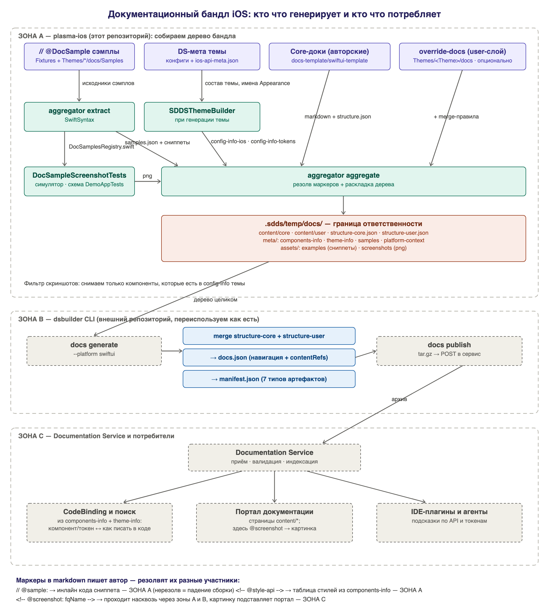

# Документационный бандл iOS

Как plasma-ios готовит документацию дизайн-системы и передаёт её в DS Builder.
Паритет с Android-агрегатором (plasma-android, задачи `documentationExtract` /
`documentationAggregate` внутри `plugin_theme_builder`).

> ⚠️ Не путать со словом «бандл» в [DesignSystemBuilder/README.md](../DesignSystemBuilder/README.md) —
> там так называются автономные исходники темы (`--standalone`). Здесь речь о
> документационном бандле.

## Три зоны ответственности

Граница проходит по каталогу `Themes/<Тема>Theme/.sdds/temp/docs`:

| Зона | Кто | Что делает |
| --- | --- | --- |
| **A** | этот репозиторий | собирает **дерево бандла** |
| **B** | внешний `dsbuilder` (Kotlin/Native, репозиторий design-system-builder) | превращает дерево в **архив** и публикует |
| **C** | Documentation Service | принимает, индексирует, отдаёт порталу/IDE |

Мы отвечаем только за зону A. Зоны B и C переиспользуются как есть — `swiftui` там
уже поддержан, дорабатывать ничего не нужно.

> ⚠️ Два CLI с похожими именами: наш — `dsbuilder-ios`
> (`DesignSystemBuilder/build/dsbuilder-ios/dsbuilder-ios`), внешний зоны B — `dsbuilder`.
> Раньше оба назывались `dsbuilder`, поэтому в старых инструкциях наш писался полным путём.



## Быстрый старт

Зону A целиком делает одна команда — она же вызывается делегатом платформы из зоны B:

```bash
DesignSystemBuilder/build/dsbuilder-ios/dsbuilder-ios docs aggregate \
  --sdds "$PWD/Themes/SDDSservTheme/.sdds" --artifact-version 0.12.0 --report
```

Она извлекает сэмплы, рендерит маркеры и раскладывает дерево в `<sdds>/temp/docs`.
Корень репозитория, user-слой, сэмплы темы и скриншоты находятся сами — по положению `.sdds`.

Обёртка, которая заодно проверит `ios-api-meta.json` и info-артефакты темы:

```bash
scripts/generate_docs_bundle.sh --theme SDDSserv --artifact-version 0.12.0
```

Дальше архив собирает внешний CLI:

```bash
dsbuilder docs generate --platform swiftui \
  --docs-dir "$PWD/Themes/SDDSservTheme/.sdds/temp/docs" \
  --output   "$PWD/Themes/SDDSservTheme/.sdds/temp/docs-bundle.tar.gz"
```

С зарегистрированным делегатом платформы этот шаг сам вызывает `dsbuilder-ios docs aggregate`,
поэтому отдельный запуск зоны A не нужен: достаточно `dsbuilder docs generate` из каталога темы.

## Что делает каждый шаг

### 1. `dsbuilder themes` — info-артефакты темы

Генерятся вместе с темой, отдельного запуска не требуют:

| Файл | Что внутри |
| --- | --- |
| `Themes/<Тема>Theme/.sdds/config-info-ios.json` | состав компонентов: `key`, `coreName`, `styleName`, `props`, `variations[].reference` (dot-notation вида `FormItem.Default`) |
| `Themes/<Тема>Theme/.sdds/config-info-tokens-ios.json` | токены темы со значениями и `themeReference` |

`styleApi` заполняется **только** там, где реально сгенерирован Swift-тип
`<Component>Styles` (сейчас это FormItem). Иначе документация обещала бы API,
которого нет в коде.

### 2. `extract` — сэмплы

```bash
DesignSystemBuilder/build/dsbuilder-ios/dsbuilder-ios docs extract --repo-root . --report
```

Ищет `// @DocSample` в `SDDSComponentsFixtures/…/Samples` и `Themes/<Тема>/docs/Samples`
(слой темы перекрывает core по `id`), вытаскивает тело сэмпла через SwiftSyntax
(разворачивает `swiftCodeSnippet{}`, сворачивает `placeholder(...)`, снимает отступ)
и пишет `samples.json` + файлы сниппетов. С `--emit-registry` генерит
`DocSamplesRegistry.swift` — без него скриншот-тест не смог бы перечислить сэмплы,
они `internal`.

Маркер поддерживает опции: `// @DocSample id=<имя> needScreenshot=false`.

### 3. Скриншоты

Хранятся в репозитории per-theme — `Themes/<Тема>Theme/docs/screenshots/*.png`, как на
Android. Пересъёмка (аналог record-режима снапшотов) сразу по всем темам:

```bash
TEST_RUNNER_DOCS_SCREENSHOTS_ROOT=$PWD \
xcodebuild test -project SDDSDemoApp/SDDSDemoApp.xcodeproj \
  -scheme SDDSDemoAppTests -destination 'platform=iOS Simulator,name=iPhone 16' \
  -only-testing:SDDSDemoAppTests/DocSampleScreenshotTests
```

Без переменной тест пропускается, поэтому обычные прогоны репозиторий не трогают.

Тема применяется публичным `Theme.initialize(onComplete:)`: он кладёт дефолтные
appearance в общий `EnvironmentValueProvider` и грузит шрифты темы. Сэмпл рисуется под
темой, если **не передаёт `appearance` явно**. Тема-зависимыми оставлены те, где
вариация — суть примера (`Image` 1:1 / 16:9, `Select` single / multiple) и где параметр
обязателен по API (`CheckBoxGroup`, `NavigationBar`, `Modal`, `Loader`, `Popover`,
`Notification`, `Tooltip`) — такие картинки одинаковы во всех темах.

`EnvironmentValueProvider+DefaultValues.swift` покрывает не все компоненты, поэтому
недостающие appearance доложены **в самом тесте** — в `DocThemeCase+<Тема>.swift`, сразу
после `Theme.initialize`. Значения взяты из того, что используют сэмплы (канонический
вариант), и резолвятся против конкретной темы: тема может называть холдер иначе (`List`
против `ListNormal`) или не объявлять такую вариацию (`Spinner.l` есть в SDDSserv, нет в
PlasmaHomeDS).

Ставить дефолт имеет смысл не для всякого компонента: у 21 типа appearance
`defaultValue` возвращает пустое значение и провайдер не читает (`Accordion`,
`DropdownMenu`, `List`, `Select`, `TabBar`, `NavigationBar*`, `Editable`, `Wheel`, …).
Такие сэмплы остаются с явным `appearance` — иначе они отрисовались бы без оформления.

> Почему не в темах: `EnvironmentValueProvider` — глобальный синглтон, и добавление
> дефолта меняет рендер приложения, а не только документации. На этом уже падали
> снапшоты `TabsSnapshotTest` (кейсы с `clipMode: .showMore` берут оформление
> выпадающего списка из окружения). Выбор «дефолтной вариации» темы — продуктовое
> решение; пока оно не принято, дефолты живут в тестовом окружении.
>
> Плата за это: пример в документации показывает вызов без `appearance`, хотя для части
> компонентов тема такого дефолта не отдаёт — в приложении такой вызов отрисуется без
> оформления.

Количество снимков на тему разное: фильтр идёт по `config-info-ios.json` темы (аналог
Android `ProvidedStyleKeys`).

### 4. `aggregate` — дерево бандла

```bash
DesignSystemBuilder/build/dsbuilder-ios/dsbuilder-ios docs aggregate \
  --repo-root . --theme SDDSserv --screenshots Themes/SDDSservTheme/docs/screenshots
```

Рендерит Core-доки (`docs-template/swiftui-template/docs` + `structure.json`) и
необязательный user-слой (`Themes/<Тема>Theme/docs/override-docs`), раскладывает
дерево и копирует meta/assets.

Правила user-слоя: `merge: append` требует `+`-префикс имени файла, `replace`
допускается, `prepend` отклоняется.

## Маркеры в markdown

Пишет их автор документации, а резолвят **разные участники**:

| Маркер | Кто резолвит | Во что превращается |
| --- | --- | --- |
| `// @sample: <путь>` (в swift-fence) | зона A | тело сниппета инлайном; нерезолв — **ошибка сборки** |
| `<!-- @style-api -->` | зона A | таблица параметров стиля + примеры вызова из `components-info`; если готовых стилей нет — блок `:::warning` |
| `<!-- @screenshot: <fqName> -->` | зона C | проходит через A и B **нетронутым**, картинку подставляет портал |

Агрегатор сверяет каждый `@screenshot`-маркер с доставленными png и предупреждает о
расхождении — маркер без картинки станет битой ссылкой у потребителя.

## Что уходит во внешний dsbuilder

Каталог `DesignSystemBuilder/.sdds/temp/docs`:

| Путь | Кто это читает |
| --- | --- |
| `content/core/**.md`, `content/user/**.md` | сервис (`CONTENT_ROOT`) |
| `structure-core.json`, `structure-user.json` | **CLI** — мержит в `docs.json` |
| `meta/platform-context.json` | **CLI** — валидирует `platform`, версией перекрывает манифест |
| `meta/components-info.json`, `meta/theme-info.json` | сервис → CodeBinding |
| `meta/samples.json` | пока не читается, сервис его толерирует |
| `assets/examples/swift/**` | сервис (`CODE_EXAMPLES`) |
| `assets/screenshots/*.png` | сервис (`SCREENSHOTS`) |

Оба `structure-*.json` обязаны нести `"schemaVersion": "1.0"` — без него
`docs generate` падает на чтении структур.

`docs generate` **дописывает в это же дерево** `docs.json` и `manifest.json`, а затем
пакует всё в tar.gz. То есть после прогона CLI файлов в каталоге станет на два больше.

## Сборка внешнего dsbuilder CLI

Готового бинаря нет: docs-функциональность живёт в
[design-system-builder#60](https://github.com/salute-developers/design-system-builder/pull/60)
(ветка `chore/unify-repositories`), в `dev` её ещё нет.

```bash
git clone --depth 1 --branch chore/unify-repositories --single-branch \
  https://github.com/salute-developers/design-system-builder.git
cd design-system-builder/frontend-kt && sh install-local-cli.sh
```

Сборка Kotlin/Native занимает около шести минут. Скрипт ставит бинарь в
`~/.local/bin`; если прав на этот каталог нет, запускайте напрямую:

```
frontend-kt/cli/build/bin/macosArm64/releaseExecutable/dsbuilder.kexe
```

## Публикация

```bash
<внешний dsbuilder> docs publish --bundle <путь к tar.gz>
```

Адрес сервиса задавать не нужно — у CLI зашит дефолт
(`https://gateway.design-system-builder.ru`), переопределяется флагом `--api-url` или
переменной `DSBUILDER_API_URL`.

Ключ берётся из `--api-key` → переменной, имя которой указано в `.sdds/config.json`
(`credential.name`, у нас `DSBUILDER_API_KEY`) → `DSBUILDER_API_KEY`. В репозитории
хранится **только ссылка на имя переменной**, сам секрет — у того, кто запускает.

## Известные ограничения

- **`designSystem.id` в манифесте выходит `"unknown"`**, если рядом с рабочей
  директорией нет `.sdds/config.json` — CLI берёт идентификатор оттуда. Влияние на
  приём бандла сервисом не проверено.
- **`docs publish` не проверялся** — нужен ключ проекта и решение, под каким
  `projectId` публикуется документация iOS.
- **`EnvironmentValueProvider+DefaultValues.swift` рукописный** и покрывает не все
  компоненты; недостающее доложено в обёртках скриншот-теста (см. шаг 3). Пока дефолты
  не переедут в темы, код примеров для этих компонентов не воспроизводится один-в-один в
  приложении.
- **Не покрыты вовсе** `ButtonGroup`, `Autocomplete`, `Toolbar`, `ChipGroup`,
  `CollapsingNavigationBar`: у них нет сэмплов, а значит нет и канонического варианта,
  который можно было бы взять за дефолт, — угадывать его мы не стали.
- **Синтаксис маркеров нигде не специфицирован** — это де-факто конвенция Android,
  которую мы повторяем.

## Где что лежит

| Что | Где |
| --- | --- |
| Тул агрегатора | подкоманды `docs` в [DesignSystemBuilder](../DesignSystemBuilder) (`DocsAggregatorCore/`, + его `CLAUDE.md`) |
| Обвязка | [scripts/generate_docs_bundle.sh](../scripts/generate_docs_bundle.sh) |
| Core-корпус документации | `docs-template/swiftui-template/docs` |
| Сэмплы | `SDDSComponentsFixtures/Sources/SDDSComponentsFixtures/Samples` |
| Скриншот-тест | `SDDSDemoApp/SDDSDemoAppTests/DocScreenshots` |
| История решений | `openspec/changes/archive/2026-09-01-ios-docs-aggregator` + спеки в `openspec/specs/` |
